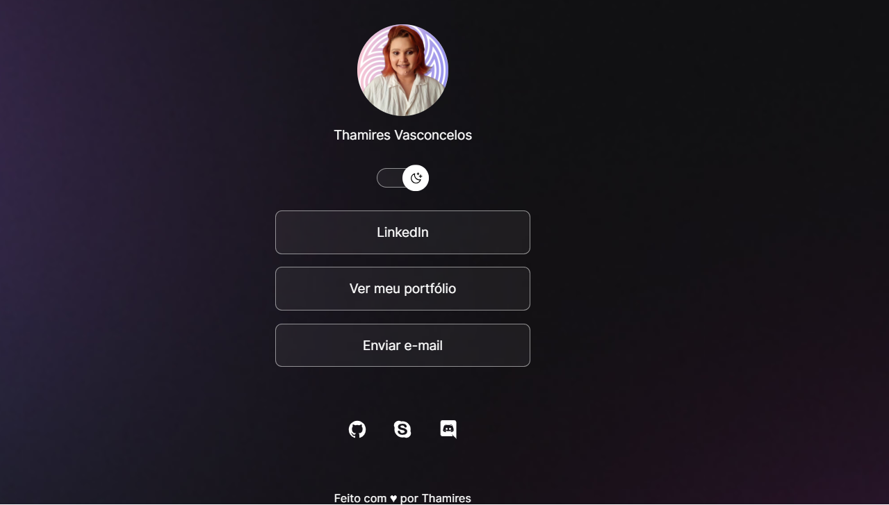

<h1 align="center">DevLinks</h1>

<i>DevLinks é um agragador de links para usar como cartão de visitas online</i>

  

## 🔧 Tecnologias

Esse projeto foi desenvolvido com as seguintes tecnologias:

- HTML e CSS
- JavaScript
- Git e Github
- Figma

## 📚 Layout

Você pode visualizar o layout do projeto através [DESSE LINK](https://figma.com/file/MF894TdzM99Fg0Ssu$KyMq/DevLinks-(Copy)?node-id1%3A113&t=8x94o7ecTaQMC2CS-1/duplicate). É necessário ter conta no [FIGMA](https://figma.com) para acessá-lo.
## :memo: Licença

Esse projeto está sob licença MIT.
